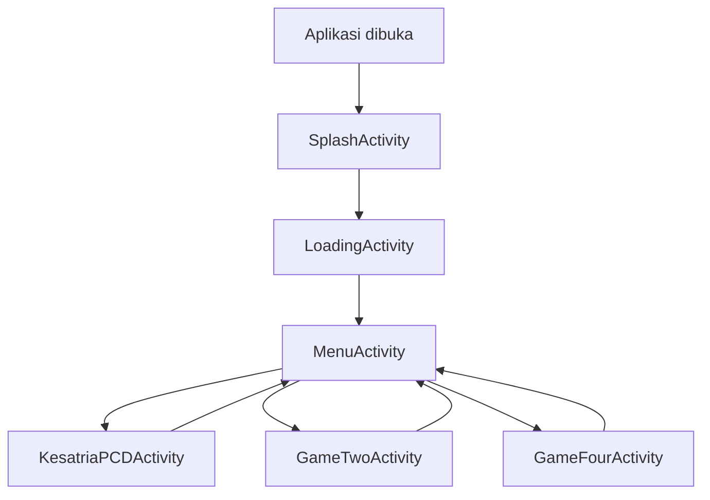

# Dokumentasi Alur Sistem KinetiQFun

Dokumen ini menjelaskan alur lengkap sistem KinetiQFun, mulai dari aplikasi dibuka, perpindahan layar, hingga mekanisme inti di setiap mode permainan.

## 1. Gambaran Umum

KinetiQFun adalah aplikasi game berbasis kamera yang memakai ML Kit Pose Detection untuk membaca pose pemain secara real time. Aplikasi berjalan dalam mode landscape, fullscreen, dan edge-to-edge. Hampir semua layar menjaga layar tetap menyala dan menyembunyikan system bar agar pengalaman bermain konsisten.

Sistem utama terdiri dari:

- Splash video sebagai layar pembuka.
- Loading screen sebagai transisi awal ke menu.
- Menu pemilihan game berbentuk carousel.
- Tiga mode game utama:
  - Kesatria PCD
  - Geol Kicau Mania
  - Tiru Gaya
- Lapisan bersama untuk kamera, deteksi pose, audio, dan transisi visual.

## 2. Alur Navigasi Utama

### Urutan yang aktif saat ini

1. Aplikasi dibuka dari launcher.
2. `SplashActivity` memutar video splash.
3. Setelah video selesai atau error, sistem pindah ke `LoadingActivity`.
4. `LoadingActivity` menampilkan progress loading, tips, lalu tombol start.
5. Tombol start membuka `MenuActivity`.
6. Dari menu, pemain memilih salah satu game.
7. Game dijalankan dengan kamera depan dan deteksi pose dua pemain.
8. Jika game selesai, pemain bisa kembali ke menu atau mengulangi permainan.

## 3. Titik Masuk Aplikasi

### `SplashActivity`

Fungsi:

- Menjadi launcher activity.
- Memutar video splash dari resource `splash_video`.
- Menjaga layar fullscreen dan tetap menyala.
- Mengarahkan ke loading screen setelah video selesai atau gagal diputar.

Perilaku penting:

- Jika aplikasi dibuka lagi dari launcher saat masih hidup di background, activity ini akan langsung selesai agar tidak membuat instance baru.
- Transisi perpindahan layar memakai `RainbowTransition`.

### `LoadingActivity`

Fungsi:

- Menjadi jembatan dari splash ke menu.
- Menampilkan progress loading dari 0 sampai 100 persen.
- Memunculkan tips acak untuk pemain.
- Menampilkan tombol start setelah progress selesai.
- Mengaktifkan background music pada level aplikasi.

Setelah tombol start ditekan:

- Sistem memanggil `RainbowTransition.navigate(...)`.
- Activity berpindah ke `MenuActivity` dan loading ditutup.

## 4. Menu Pemilihan Game

### `MenuActivity`

Fungsi:

- Menampilkan daftar game dalam bentuk carousel horizontal.
- Menyediakan tombol informasi developer.
- Mengarahkan pemain ke mode game yang dipilih.

Daftar game yang tampil:

- Kesatria PCD
- Geol Kicau Mania
- Tiru Gaya

Mekanisme pemilihan:

- RecyclerView menggunakan `LinearLayoutManager` horizontal dan `PagerSnapHelper`.
- Item di tengah layar dianggap sebagai item aktif.
- Jika item diklik saat posisinya belum di tengah, sistem akan menggeser dulu ke tengah.
- Jika sudah berada di tengah, sistem membuka activity game terkait.

Pemetaan menu ke activity:

- Kesatria PCD -> `KesatriaPCDActivity`
- Geol Kicau Mania -> `GameTwoActivity`
- Tiru Gaya -> `GameFourActivity`

Efek visual menu:

- Skala item mengecil saat menjauh dari tengah.
- Ada efek tilt 3D dan blur untuk item yang tidak aktif.
- Padding dinamis dipakai agar item pertama dan terakhir benar-benar bisa terpusat.

## 5. Lapisan Bersama Game Kamera

### `BasePoseActivity`

Ini adalah fondasi untuk mode game berbasis pose. Semua game utama yang memakai kamera mewarisi class ini, sehingga logika umum tidak perlu ditulis ulang.

Tanggung jawab utama:

- Menyiapkan CameraX preview dan image analyzer.
- Meminta izin kamera jika belum diberikan.
- Menangani dua pose detector ML Kit secara paralel.
- Membagi frame kamera menjadi dua sisi untuk dua pemain.
- Menyediakan sound effects dasar melalui `SoundPool`.
- Menangani tombol kembali dengan dialog konfirmasi keluar.
- Menyediakan tombol play again dan back to menu.

### Alur kamera di base class

1. Kamera dipasang lewat CameraX.
2. Frame diambil oleh `ImageAnalysis`.
3. Frame dikonversi menjadi bitmap dan diputar sesuai orientasi.
4. Frame dibagi menjadi dua bagian:
   - sisi kiri untuk satu pemain
   - sisi kanan untuk pemain lain
5. Masing-masing sisi diproses oleh detector ML Kit terpisah.
6. Hasil pose disaring memakai `PoseEvaluator.isLikelyHuman(...)`.
7. Hasil pose dikirim ke overlay untuk dirender.
8. Hook `onPoseDetected(...)` dipanggil agar subclass bisa menjalankan logika game masing-masing.

### Kenapa frame dibagi dua

ML Kit pose detector pada implementasi ini dipakai sebagai single-person detector per input. Agar dua pemain bisa dilacak bersamaan, frame dipisahkan jadi dua wilayah. Untuk kamera depan, sisi kiri dan kanan dibalik karena mirror effect.

## 6. Deteksi Pose dan Validasi

### `PoseEvaluator`

Class ini dipakai untuk dua hal:

- mengekstrak fitur pose,
- memvalidasi apakah pose yang terdeteksi cukup layak dianggap manusia nyata.

#### Ekstraksi fitur

`extractFeatures(...)` membaca landmark penting seperti:

- bahu,
- siku,
- pergelangan tangan,
- pinggul,
- lutut,
- pergelangan kaki.

Kemudian sistem menghitung 8 sudut relatif terhadap garis spine. Hasilnya dipakai untuk membandingkan kesamaan pose antar frame atau terhadap target pose.

#### Pembandingan pose

`compareFeatures(...)` menghasilkan nilai kemiripan 0 sampai 100 persen. Semakin kecil selisih sudut antar fitur, semakin tinggi skornya.

#### Validasi manusia

`isLikelyHuman(...)` memastikan pose tidak asal terdeteksi. Syarat utamanya:

- landmark penting harus muncul dengan confidence memadai,
- minimal ada satu landmark wajah yang kuat,
- rata-rata confidence landmark harus cukup tinggi.

## 7. Lapisan Render dan State Game

### `OverlayView`

View ini adalah lapisan visual utama di atas kamera. Ia menggambar elemen game, skeleton, efek partikel, efek kemenangan, dan indikator skor/progress.

Kemampuan utama:

- menggambar pose dua pemain,
- menampilkan mode game yang aktif,
- merender objek batu, efek hit, partikel, dan teks mengambang,
- menampilkan progres balapan atau skor sesuai mode,
- menampilkan layar kemenangan.

Mode yang didukung:

- `KESATRIA`
- `BALAP_GEOL`
- `TIRU_GAYA`
- `NONE`

### `GameStateViewModel`

ViewModel ini dipakai terutama di mode Kesatria PCD untuk menyimpan state UI secara reaktif, misalnya:

- skor pemain 1,
- skor pemain 2,
- daftar batu,
- pemenang,
- mode game.

## 8. Alur Mode Game

### 8.1 Kesatria PCD

Activity: `KesatriaPCDActivity`

Konsep game:

- Dua pemain berada di depan kamera.
- Game diawali dengan video tutorial.
- Setelah tutorial selesai, sistem menunggu dua pemain terdeteksi dan perangkat stabil.
- Saat kondisi siap terpenuhi, game masuk countdown lalu mulai.

Alur detail:

1. Activity dibuka dari menu.
2. Musik background khusus mode ini diaktifkan.
3. Tutorial video diputar sebagai pengantar aturan main.
4. Setelah video selesai, sistem masuk mode menunggu pemain.
5. Accelerometer dipakai untuk mengecek apakah perangkat stabil dan tidak rebah.
6. Jika kedua pemain terdeteksi dan perangkat stabil, countdown dimulai.
7. Saat game berlangsung, pose pemain dipakai untuk mendeteksi gerakan serangan.
8. Batu di setiap sisi layar bereaksi terhadap serangan pemain.
9. Saat batu hancur atau skor target tercapai, game menampilkan pemenang.

Komponen kunci:

- `ViewModel` untuk sinkronisasi state UI.
- `SensorManager` untuk stabilisasi perangkat.
- `CountDownTimer` untuk tutorial, countdown, dan ritme permainan.
- `SoundPool` untuk efek hit dan kemenangan.

### 8.2 Geol Kicau Mania

Activity: `GameTwoActivity`

Konsep game:

- Dua pemain berlomba menggerakkan tubuh secara lateral.
- Sistem membaca perubahan posisi pinggul kiri/kanan sebagai indikator goyangan/geol.
- Setiap perubahan arah yang valid menambah progres pemain.

Alur detail:

1. Activity dibuka dari menu.
2. Musik background khusus mode ini diaktifkan.
3. Tutorial video diputar.
4. Sistem menunggu dua pemain dan kondisi perangkat stabil.
5. Countdown dimulai.
6. Saat game aktif, `onPoseDetected(...)` memeriksa landmark pinggul.
7. Perubahan arah gerak pinggul yang bolak-balik dianggap gerakan valid.
8. Progress pemain bertambah sampai mencapai 100 persen.
9. Pemain pertama yang penuh progres menjadi pemenang.

Karakteristik mode ini:

- Fokus pada deteksi gerakan badan secara ritmis.
- Tidak memakai objek hancur, tetapi progres balapan.
- Overlay menampilkan nama pemain, progres, dan status pemenang.

### 8.3 Tiru Gaya

Activity: `GameFourActivity`

Konsep game:

- Game menampilkan pose target.
- Pemain meniru pose target selama hitungan waktu tertentu.
- Setelah timer habis, sistem membandingkan pose pemain dengan target dan memberi skor.

Alur detail:

1. Activity dibuka dari menu.
2. Overlay khusus mode ini ditambahkan ke root view.
3. Pose target pra-proses dimuat dari beberapa drawable karakter.
4. Setiap target pose diekstrak fiturnya memakai `PoseEvaluator`.
5. Tutorial video diputar.
6. Setelah tutorial dan model target siap, sistem menunggu dua pemain.
7. Saat dua pemain terdeteksi, round dimulai.
8. Sistem menampilkan pose target dan countdown 5 detik.
9. Setelah timer selesai, kamera di-snapshot.
10. Pose pemain terakhir yang terdeteksi dibandingkan dengan target.
11. Skor ronde diberikan ke pemain dengan kemiripan lebih tinggi.
12. Setelah beberapa ronde, pemenang akhir ditentukan.

Karakteristik mode ini:

- Ada perhitungan kemiripan pose berbasis fitur.
- Ada snapshot kamera untuk menampilkan hasil visual saat evaluasi.
- Jika skor seri, sistem masuk sudden death.

## 9. Transisi, Audio, dan UX Global

### `RainbowTransition`

Transisi antar layar memakai animasi sapuan warna pelangi.

- `navigate(...)` dipakai saat pindah ke activity baru.
- `reveal(...)` dipakai saat activity baru selesai dibuka agar transisi keluar terlihat halus.

### `SoundManager`

Mengelola sound effect global seperti:

- klik tombol,
- transisi layar.

### Musik latar aplikasi

`KinetiqFunApp` menyimpan dan mengatur musik latar di level aplikasi.

Aturannya:

- musik mulai saat aplikasi masuk foreground,
- musik dijeda saat aplikasi ke background,
- mode game tertentu bisa mengganti musik ke resource yang spesifik,
- saat keluar dari game, musik bisa dikembalikan ke default.

## 10. Tutorial Onboarding

### `TutorialActivity`

Activity ini tersedia sebagai onboarding berbasis ViewPager yang menjelaskan konsep dasar permainan. Namun pada konfigurasi manifest saat ini, activity ini belum menjadi bagian dari alur utama yang aktif.

Isi tutorial:

- Learn the Basics
- Kesatria PCD
- Dance Master
- Pose Fighter

Jadi, secara kode fitur tutorial ada, tetapi alur aplikasi aktif saat ini berjalan langsung dari splash ke loading, lalu menu.

## 11. Komponen yang Ada Tetapi Tidak Menjadi Entry Flow Utama

### `MainActivity`

`MainActivity` saat ini berfungsi sebagai demo/pembaca pose kamera dengan dua detector paralel, tetapi bukan activity awal aplikasi. Ia tetap berguna sebagai referensi struktur kamera dan overlay, namun jalur pemakaian utama permainan berada di `BasePoseActivity` dan turunannya.

## 12. Ringkasan Alur Sistem End-to-End

1. Aplikasi dibuka.
2. Splash video diputar.
3. Loading screen muncul dan menyiapkan musik serta transisi awal.
4. Menu menampilkan tiga game dalam carousel.
5. Pemain memilih game.
6. Sistem menyiapkan kamera, audio, overlay, dan state game.
7. Tutorial game diputar jika mode membutuhkan.
8. Sistem menunggu dua pemain dan stabilitas perangkat.
9. Countdown dimulai.
10. Deteksi pose berjalan real time.
11. Mekanik game spesifik dijalankan sesuai mode.
12. Pemenang ditampilkan dan pemain bisa mengulang atau kembali ke menu.

## 13. Kesimpulan Teknis

Arsitektur sistem ini memisahkan tiga lapisan utama:

- lapisan navigasi layar,
- lapisan input pose kamera,
- lapisan aturan dan render game.

Pemecahan ini membuat mode baru lebih mudah ditambahkan, karena activity baru cukup mewarisi fondasi kamera dari `BasePoseActivity` atau memakai pola render yang sama dengan `OverlayView` dan `PoseEvaluator`.